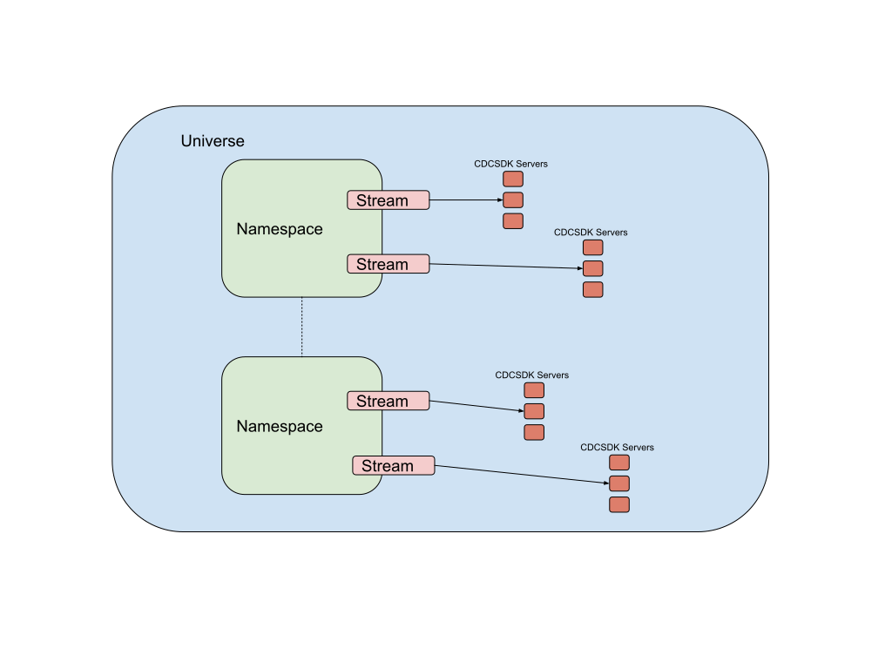

# Yugabyte CDCSDK Server [BETA]

Yugabyte CDCSDK Server is an open source project that provides a streaming platform for change data capture from YugabyteDb. The server is based on the [Debezium](debezium.io).
CDCSDK Server uses [debezium-yugabytedb-connector](https://github.com/yugabyte/debezium-connector-yugabytedb) to capture change data events.
It supports a YugabyteDb instance as a source and supports the following sinks:

* Kafka
* HTTP REST Endpoint
* AWS S3

- [Yugabyte CDCSDK Server [BETA]](#yugabyte-cdcsdk-server-beta)
  - [Basic architecture](#basic-architecture)
    - [Engine is the Unit of Work](#engine-is-the-unit-of-work)
    - [CDCSDK Server](#cdcsdk-server)
  - [Quick Start](#quick-start)
    - [Create a CDCSDK Stream in Yugabytedb](#create-a-cdcsdk-stream-in-yugabytedb)
    - [Run CDCSDK Server using Docker](#run-cdcsdk-server-using-docker)
    - [Download and run CDCSDK Server](#download-and-run-cdcsdk-server)
    - [Unpack and Run Instructions.](#unpack-and-run-instructions)
  - [Configuration](#configuration)
    - [Configuration using Environment Variables](#configuration-using-environment-variables)
    - [Server configuration](#server-configuration)
    - [Kafka Client/Confluent Cloud](#kafka-clientconfluent-cloud)
    - [HTTP Client](#http-client)
    - [Amazon S3](#amazon-s3)
    - [Mapping Records to S3 Objects](#mapping-records-to-s3-objects)
      - [IAM Policy](#iam-policy)
    - [Google Pub/Sub](#google-pubsub)
    - [Amazon Kinesis](#amazon-kinesis)
    - [Azure Event Hubs](#azure-event-hubs)
  - [Record Structure](#record-structure)
  - [Operations](#operations)
    - [Topology](#topology)
    - [Networking](#networking)
    - [Healthchecks](#healthchecks)
      - [Running the health check](#running-the-health-check)
    - [Metrics](#metrics)
      - [System Metrics](#system-metrics)
      - [Application Metrics](#application-metrics)
      - [Integration with Prometheus](#integration-with-prometheus)

## Basic architecture

### Engine

A [Debezium Engine](https://debezium.io/documentation/reference/1.9/development/engine.html) implementation is the unit of work. It implements a pipeline consisting of a source, sink and simple transforms. The only supported source is YugabyteDB. The source is assigned a set of tablets that is polled at a configurable interval. An engine’s workflow is as follows:

* Connect to CDCSDK stream
* Get a list of tables and filter based on the include list.
* Get and record a list of tablets.
* Poll tablets in sequence every polling interval

### Server

The CDCSDK server hosts a Debezium Engine. The implementation is based on the [Debezium Server](https://debezium.io/documentation/reference/1.9/operations/debezium-server.html). It uses the Quarkus framework and extensions to provide a server shell, metrics, and alerts. By default, a server runs one Engine implementation in a thread. A server can also run in multi-threaded mode wherein multiple engines are assigned to a thread each. The server splits tablets into groups in a deterministic manner. Each group of tablets is assigned to an Engine.

## Quick start

### Create a CDCSDK stream in YugabyteDB

Use [yb-admin](../../../admin/yb-admin/#create-change-data-stream) to create a CDC stream. If successful, the operation returns the stream ID; note the ID, as it is used in later steps. For example:

```output
CDC Stream ID: d540f5e4890c4d3b812933cbfd703ed3
```

### Run CDCSDK server using Docker

You can run the CDCSDK server inside a Docker container, and pass all the configuration properties to the container in the form of environment variables. For more information, refer to [Configuration](#configure-using-environment-variables).

```sh
docker run -it --rm --name cdcsdk-server -p 8080:8080 \
  -e <CONFIGURATION>
  quay.io/yugabyte/cdcsdk-server:latest
```

### Download and run CDCSDK server

CDCSDK server distribution archives are available in [Releases](https://github.com/yugabyte/cdcsdk-server/releases) of the project.
Each of the releases has a tar.gz named CDCSDK server.

The archive has the following layout:

```output
  cdcsdk-server
  |-- conf
  |-- cdcsdk-server-dist-<CDCSDK VERSION>-runner.jar
  |-- lib
  |-- run.sh
```

### Unpack and run the application

```sh
export CDCSDK_VERSION=<x.y.z>
wget https://github.com/yugabyte/cdcsdk-server/releases/download/v${CDCSDK_VERSION}/cdcsdk-server-dist-${CDCSDK_VERSION}.tar.gz

# OR Using gh cli

gh release download v{CDCSDK_VERSION} -A tar.gz --repo yugabyte/cdcsdk-server

tar xvf cdcsdk-server-dist-${CDCSDK_VERSION}.tar.gz
cd cdcsdk-server

# Configure the application. Check next section
touch conf/application.properties

# Run the application
./run.sh
```

## Configuration

The main configuration file is `conf/application.properties`, which includes the following sections:

* `cdcsdk.source` is for configuring the source connector.
* `cdcsdk.sink` is for the sink system configuration.
* `cdcsdk.transforms` is for the configuration of message transformations.

Following is an example configuration file:

```conf
cdcsdk.sink.type=kafka
cdcsdk.sink.kafka.producer.bootstrap.servers=127.0.0.1:9092
cdcsdk.sink.kafka.producer.key.serializer=org.apache.kafka.common.serialization.StringSerializer
cdcsdk.sink.kafka.producer.value.serializer=org.apache.kafka.common.serialization.StringSerializer
cdcsdk.source.connector.class=io.debezium.connector.yugabytedb.YugabyteDBConnector
cdcsdk.source.database.hostname=127.0.0.1
cdcsdk.source.database.port=5433
cdcsdk.source.database.user=yugabyte
cdcsdk.source.database.password=yugabyte
cdcsdk.source.database.dbname=yugabyte
cdcsdk.source.database.server.name=dbserver1
cdcsdk.source.database.streamid=<CDCSDK Stream>
cdcsdk.source.table.include.list=public.test
cdcsdk.source.database.master.addresses=127.0.0.1:7100
cdcsdk.source.snapshot.mode=never
```

### Configuration using environment variables

Using environment variables for configuration can be useful when running in containers. The rule of thumb is to convert the keys to UPPER CASE and replace `.` with `_`. For example, change `cdcsdk.source.database.port` to `CDCSDK_SOURCE_DATABASE_PORT`.

### Server configuration

| Property | Default | Description |
 | :--- | :--- | :--- |
 | `cdcsdk.server.transforms` | | Transformations to apply. |

**Additional configuration:**

 | Property | Default | Description |
 | :--- | :--- | :--- |
 | `quarkus.http.port` | 8080 | The port on which the CDCSDK server exposes Microprofile Health endpoint and other exposed status information. |
 | `quarkus.log.level` | INFO | The default log level for every log category. |
 | `quarkus.log.console.json` | true | Determines whether to enable the JSON console formatting extension, which disables "normal" console formatting. |

### Kafka client/Confluent cloud

The Kafka client will stream changes to a Kafka message broker or to Confluent Cloud.

|Property|Default|Description|
|--------|-------|-----------|
|cdcsdk.sink.type||Must be set to `kafka`|
|cdcsdk.sink.kafka.producer.*||The Kafka sink adapter supports pass-through configuration. This means that all Kafka producer configuration properties are passed to the producer with the prefix removed.At least `bootstrap.servers`, `key.serializer` and `value.serializer` properties must be provided. At least `bootstrap.servers`, `key.serializer` and `value.serializer` properties must be provided. The topic is set by CDCSDK Server.|

### HTTP client

The HTTP client will stream changes to any HTTP server for additional processing.

|Property|Default|Description|
|--------|-------|-----------|
|cdcsdk.sink.type||Must be set to `http`|
|cdcsdk.sink.http.url||The HTTP Server URL to stream events to. This can also be set by defining the K_SINK environment variable, which is used by the Knative source framework.|
|cdcsdk.sink.http.timeout.ms|60000|The number of seconds to wait for a response from the server before timing out. (default of 60s)|

### Amazon S3

The Amazon S3 sink streams changes to an AWS S3 bucket. Only **Inserts** are supported.

> **Note**
> Amazon S3 Sink supports a single table at a time. Specifically `cdcsdk.source.table.include.list` should contain only one table at a time. If multiple tables need to be exported to Amazon S3, multiple CDCSDK servers that read from the same CDC Stream ID but write to different S3 locations should be setup.

The available configuration options are:

|Property|Default|Description|
|--------|-------|-----------|
|cdcsdk.sink.type||Must be set to `s3`|
|cdcsdk.sink.s3.aws.access.key.id||AWS Access Key ID|
|cdcsdk.sink.s3.aws.secret.access.key||AWS Secret Access Key|
|cdcsdk.sink.s3.bucket.name|| Name of S3 Bucket|
|cdcsdk.sink.s3.region|| Name of the region of the S3 bucket|
|cdcsdk.sink.s3.basedir||Base directory or path where the data has to be stored|
|cdcsdk.sink.s3.pattern||Pattern to generate paths (sub-directory and filename) for data files|
|cdcsdk.sink.s3.flush.sizeMB|200|Trigger Data File Rollover on file size|
|cdcsdk.sink.s3.flush.records|10000|Trigger Data File Rolloever on number of records|

### Mapping records to S3 objects

The Amazon S3 Sink only supports [create events](https://docs.yugabyte.com/preview/explore/change-data-capture/debezium-connector-yugabytedb/#create-events)
in the CDC Stream. It writes `payload.after` fields to a file in S3.

The filename in S3 is generated as `${cdcsdk.sink.s3.basedir}/${cdcsdk.sink.s3.pattern}`. The pattern can contain placeholders to customize the filenames, as follows:

* {YEAR}: Year in which the sync was writing the output data in.
* {MONTH}: Month in which the sync was writing the output data in.
* {DAY}: Day in which the sync was writing the output data in.
* {HOUR}: Hour in which the sync was writing the output data in.
* {MINUTE}: Minute in which the sync was writing the output data in.
* {SECOND}: Second in which the sync was writing the output data in.
* {MILLISECOND}: Millisecond in which the sync was writing the output data in.
* {EPOCH}: Milliseconds since Epoch in which the sync was writing the output data in.
* {UUID}: Random UUID string.

 For example, the following pattern can be used to create hourly partitions with multiple files, each of which is no greater than 200MB:

 ```output
 {YEAR}-{MONTH}-{DAY}-{HOUR}/data-{UUID}.jsonl
 ```

#### IAM policy

The AWS user account accessing the S3 bucket must have the following permissions:

* ListAllMyBuckets
* ListBucket
* GetBucketLocation
* PutObject
* GetObject
* AbortMultipartUpload
* ListMultipartUploadParts
* ListBucketMultipartUploads

Copy the following JSON to create the IAM policy for the user account. Change to a real bucket name. For more information, see [Create and attach a policy to an IAM user](https://docs.aws.amazon.com/apigateway/latest/developerguide/api-gateway-create-and-attach-iam-policy.html).

Note: This is the IAM policy for the user account and not a bucket policy.

```json
{
   "Version":"2012-10-17",
   "Statement":[
     {
         "Effect":"Allow",
         "Action":[
           "s3:ListAllMyBuckets"
         ],
         "Resource":"arn:aws:s3:::*"
     },
     {
         "Effect":"Allow",
         "Action":[
           "s3:ListBucket",
           "s3:GetBucketLocation"
         ],
         "Resource":"arn:aws:s3:::<bucket-name>"
     },
     {
         "Effect":"Allow",
         "Action":[
           "s3:PutObject",
           "s3:GetObject",
           "s3:AbortMultipartUpload",
           "s3:ListMultipartUploadParts",
           "s3:ListBucketMultipartUploads"

         ],
         "Resource":"arn:aws:s3:::<bucket-name>/*"
     }
   ]
}
```

### Google Pub/Sub

The pubsub client streams changes to a Google Pub/Sub topic.

|Property|Default|Description|
|--------|-------|-----------|
|cdcsdk.sink.type||Must be set to `pubsub`|
|cdcsdk.sink.pubsub.project.id|system-wide default project id|A project name in which the target topics are created.|
|cdcsdk.sink.pubsub.ordering.enabled|`true`|Pub/Sub can optionally use a message key to guarantee the delivery of the messages in the same order as were sent for messages with the same order key. This feature can be disabled.|
|cdcsdk.sink.pubsub.null.key|`default`|Tables without primary key sends messages with null key. This is not supported by Pub/Sub so a surrogate key must be used.|

> **Note**
> The CDCSDK server works fine with Pub/Sub sink when both of them are under same project id. If you want to run them under different projects then run `gcloud auth application-default login` . This will prompt you to log in and will save the credentials at `~/.config/gcloud/application_default_credentials.json`. Now assign this path to the environment variable `GOOGLE_APPLICATION_CREDENTIALS` by adding the following line to \~/.bashrc `GOOGLE_APPLICATION_CREDENTIALS=~/.config/gcloud/application_default_credentials.json`. After adding the line, run `source ~/.bashrc`

### Amazon Kinesis

The configurations to stream changes to Amazon Kinesis are :

|Property|Default|Description|
|--------|-------|-----------|
|cdcsdk.sink.type||Must be set to `kinesis`|
|cdcsdk.sink.kinesis.region||A region name in which the Kinesis target streams are provided.|
|cdcsdk.sink.kinesis.credentials.profile|`default`|A credentials profile name used to communicate with Amazon API.|
|cdcsdk.sink.kinesis.null.key|`default`|Kinesis does not support the notion of messages without key. So this string will be used as message key for messages from tables without primary key.|

### Azure Event Hubs

The configurations to stream changes to Azure Event Hubs are :

|Property|Default|Description|
|--------|-------|-----------|
|cdcsdk.sink.type||Must be set to `eventhubs`|
|cdcsdk.sink.eventhubs.connectionstring||[Connection string](https://learn.microsoft.com/en-gb/azure/event-hubs/event-hubs-get-connection-string) required to communicate with Event Hubs. The format is: Endpoint=sb://<NAMESPACE>/;SharedAccessKeyName=<ACCESS_KEY_NAME>;SharedAccessKey=<ACCESS_KEY_VALUE>|
|cdcsdk.sink.eventhubs.hubname||Name of the Event hub|
|cdcsdk.sink.eventhubs.maxbatchsize||Sets the maximum size for the batch of events, in bytes.|

## Record structure

By default, the YugabyteDB connector generates a [complex record](../debezium-connector-yugabytedb/#data-change-events) in JSON with key and value information including payload. A sophisticated sink can use the information to generate appropriate commands in the receiving system.

Simple sinks expect simple key/value JSON objects, where key is the column name and value is the contents of the column. For simple sinks, set `cdcsdk.server.transforms=FLATTEN`. With this configuration, the record structure will only emit the payload as simple JSON.

With `FLATTEN`, the following simple format is emitted:

```output
 {
   "id":...,
   "first_name":...,
   "last_name":...,
   "email":...
 }
```

## Operations

### Topology



* A universe can have multiple namespaces.
* Each namespace can have multiple CDCSDK streams
* Each CDCSDK stream can have multiple servers associated with it. Default is 1. The group of multiple servers associated with a stream is called a ServerSet.

### Networking

The CDCSDK server requires access to open ports in YugabyteDB. Therefore it has to run in the same VPC (or peered VPC) as the YugabyteDB database. The server also requires access to sinks in the case of Kafka or an HTTP REST Endpoint and the appropriate credentials for writing to AWS S3.

### Health checks

CDCSDK Server exposes a simple health check REST API. Currently the health check only ensures that the
server is up and running.

#### Running the health check

The following REST endpoints are exposed:

* `/q/health/live` - The application is up and running.
* `/q/health/ready` - The application is ready to serve requests.

All of the health REST endpoints return a simple JSON object with two fields:

* `status` — The overall result of all the health check procedures.
* `checks` — An array of individual checks.

 The general status of the health check is computed as a logical AND of all the declared health check procedures.

```output
curl http://localhost:8080/q/health/live

{
    "status": "UP",
    "checks": [
        {
            "name": "debezium",
            "status": "UP"
        }
    ]
}

curl http://localhost:8080/q/health/ready

{
    "status": "UP",
    "checks": [
    ]
}
```

### Metrics

CDCSDK server exposes metrics through a REST ENDPOINT, `q/metrics`. To view metrics, execute the following:

```sh
curl localhost:8080/q/metrics/
```

Refer to the [Quarkus-Micrometer docs](https://quarkus.io/guides/micrometer#configuration-reference) for configuration options.

#### System metrics

There are a number of system metrics to monitor JVM performance such as the following:

* jvm_gc_*
* jvm_memory_*
* jvm_threads_*

#### Application Metrics

Application metrics have the prefix `cdcsdk_`. The following metrics for the application are available.

| Metric | Description |
 | :--- | :--- |
 | `cdcsdk_server_health` | A status code for the health of the server.<br> `0`: Healthy<br> `1`: Not Healthy<br><br> In the future, more states will be available for different causes. |
 | `cdcsdk_sink_totalBytesWritten` | Number of bytes written by the sink since the start of the application. |
 | `cdcsdk_sink_totalRecordsWritten` | Number of records written by the sink since the start of the application. |

#### Integration with Prometheus

Prometheus uses a pull model to get metrics from applications, this means that Prometheus will scrape or watch endpoints to pull the metrics from.

 The following job configuration will enable prometheus installation to scrape from CDCSDK server:

 ```yaml
 - job_name: 'cdcsdk-server-metrics'
    metrics_path: '/q/metrics'
    scrape_interval: 3s
    static_configs:
      - targets: ['HOST:8080']
 ```
